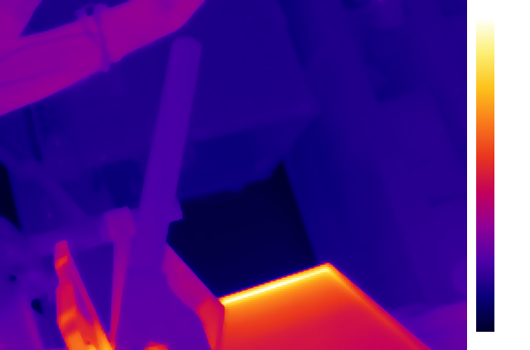

# thermalmaster

> **Disclaimer:** This is an independent hobby project by a random person on the
> internet. It is **not** affiliated with, endorsed by, or connected to
> ThermalMaster, InfiRay/IRay, any of their parent companies, or any of their
> subsidiaries in any way. All product names and trademarks are the property of
> their respective owners and are used here solely for identification purposes.

Go "driver" for ThermalMaster thermal cameras (P3, P1).

**Goal:** get the camera working. **Non-goal:** clean code.



## Features

- Pure Go USB driver for ThermalMaster P3 (256x192) and P1 (160x120) cameras
- Single-frame capture to PNG
- Streams thermal/IR/blended video to a v4l2loopback device
- Joint bilateral upsampling: combines high-res IR with thermal data for edge-preserving output
- Temperature legend overlay with configurable position, orientation, and units (Celsius/Fahrenheit/raw)
- 40+ colormaps (ironbow, inferno, viridis, turbo, jet, etc.)

## Quick Start

### Prerequisites

- Linux with v4l2loopback:

  ```sh
  sudo modprobe v4l2loopback devices=1 video_nr=10 exclusive_caps=1
  ```

- USB permissions — install the udev rule:
  ```sh
  sudo cp doc/99-thermalmaster.rules /etc/udev/rules.d/
  sudo udevadm control --reload-rules && sudo udevadm trigger
  ```
  Then re-plug the camera.

### Capture a snapshot

```sh
go run ./cmd/thermalmaster-photo photo.png
```

### Stream to v4l2

```sh
go run ./cmd/thermalmaster-v4l2loopback /dev/video10
```

View:

```sh
mpv --profile=low-latency --untimed av://v4l2:/dev/video10
```

### Common Options

Both tools share these flags:

```
--sensor string              sensor source: thermal, ir, blended (default "blended")
--colormap string            colormap name or "none" for raw output (default "ironbow")
--gain string                gain mode: auto, high, low (default "auto")
--hw-palette string          hardware palette: whitehot, blackhot, ironbow, rainbow, etc.
--brightness int             brightness level (0-100)
--contrast int               contrast level (0-100)
--mirror-flip string         mirror/flip: none, mirror, flip, both
--upscale-factor int         upscale factor for blended mode (default 2)
--upscale-workers int        parallel workers for upscaling, 0 = single-threaded (default 0)
--window-radius int          bilateral filter half-window size (1 = 3x3, 2 = 5x5) (default 1)
--shutter                    trigger shutter calibration on startup
--legend                     enable legend overlay (default true)
--legend-x float             legend X position as fraction of frame width (default 1.02)
--legend-y float             legend Y position as fraction of frame height (default 0.05)
--legend-orientation string  legend orientation: vertical, horizontal (default "vertical")
--legend-width int           legend bar width in pixels (default 20)
--legend-height int          legend bar height in pixels, 0 = 90% of frame (default 0)
--legend-font-size float     legend font size in points (default 12)
--legend-temp-unit string    temperature unit: celsius, fahrenheit, raw (default "celsius")
```

`thermalmaster-v4l2loopback` also has:

```
--max-fps int         limit output frame rate, 0 = unlimited (default 0)
--log-level string    log level: trace, debug, info, warning, error (default "warning")
--cpuprofile string   write CPU profile to file
```

`thermalmaster-photo` also has:

```
--skip int            frames to skip before capture for camera warmup (default 5)
```

## Library Usage

```go
import (
	"context"
	"github.com/xaionaro-go/thermalmaster/pkg/thermalmaster"
)

dev, err := thermalmaster.Open(thermalmaster.ModelP3)
if err != nil { ... }
defer dev.Close()

if err := dev.StartStreaming(); err != nil { ... }
defer dev.StopStreaming()

ctx := context.Background()
frame, err := dev.ReadFrame(ctx)
if err != nil { ... }

cfg := dev.Config()
thermal := thermalmaster.ExtractThermalData(frame, cfg)
```

## License

[CC0 1.0 Universal](https://creativecommons.org/publicdomain/zero/1.0/) — public domain.
See [LICENSE](LICENSE) for details.
