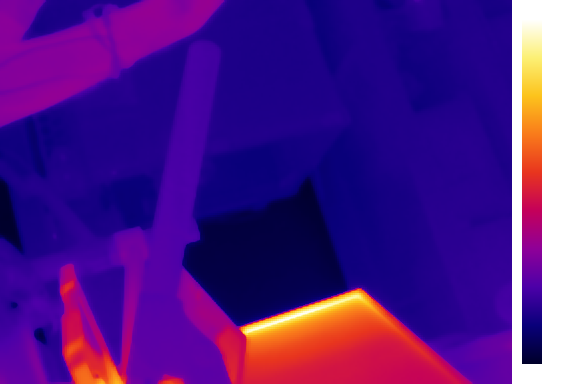

# thermalmaster

> **Disclaimer:** This is an independent hobby project by a random person on the
> internet. It is **not** affiliated with, endorsed by, or connected to
> ThermalMaster, InfiRay/IRay, any of their parent companies, or any of their
> subsidiaries in any way. All product names and trademarks are the property of
> their respective owners and are used here solely for identification purposes.

Go "driver" for ThermalMaster thermal cameras (P3, P1).

**Goal:** get the camera working. **Non-goal:** clean code.



## Features

- Go driver using `usb` for ThermalMaster P3 (256x192) and P1 (160x120) cameras
- Single-frame capture to PNG
- Streams thermal/IR/blended video to a v4l2loopback device on Linux
- Joint bilateral upsampling: combines high-res IR with thermal data for edge-preserving output
- Temperature legend overlay with configurable position, orientation, and units (Celsius/Fahrenheit/raw)
- 40+ colormaps (ironbow, inferno, viridis, turbo, jet, etc.)

## Quick Start

### Prerequisites

- A C toolchain, `pkg-config`, and the libusb 1.0 development files. On
  Debian/Ubuntu:

  ```sh
  sudo apt install build-essential pkg-config libusb-1.0-0-dev
  ```

  Non-Linux builds likewise require a target C toolchain and libusb 1.0.26 or
  newer. Linux's no-discovery, wrapped-usbfs path requires libusb 1.0.27 or
  newer. `usb` supplies the cgo bindings to libusb.

- Linux with v4l2loopback:

  ```sh
  sudo modprobe v4l2loopback devices=1 video_nr=10 exclusive_caps=1
  ```

- USB permissions — install the udev rule:
  ```sh
  sudo cp doc/99-thermalmaster.rules /etc/udev/rules.d/
  sudo udevadm control --reload-rules && sudo udevadm trigger
  ```
  Then re-plug the camera.

### Go dependency

ThermalMaster depends directly on [`github.com/xaionaro-go/usb`](https://github.com/xaionaro-go/usb),
an independently versioned continuation of gousb. `go.mod` pins its version;
Go downloads it for command builds and library consumers.

Build this repository with:

```sh
go build ./...
```

### Capture a snapshot

```sh
go run ./cmd/thermalmaster-photo photo.png
```

### Stream to v4l2

```sh
go run ./cmd/thermalmaster-v4l2loopback /dev/video10
```

View:

```sh
mpv --profile=low-latency --untimed av://v4l2:/dev/video10
```

### Common Options

Both tools share these flags:

```
--sensor string              sensor source: thermal, ir, blended (default "blended")
--colormap string            colormap name or "none" for raw output (default "ironbow")
--gain string                gain mode: auto, high, low (default "auto")
--hw-palette string          hardware palette: whitehot, blackhot, ironbow, rainbow, etc.
--brightness int             brightness level (0-100)
--contrast int               contrast level (0-100)
--mirror-flip string         mirror/flip: none, mirror, flip, both
--upscale-factor int         upscale factor for blended mode (default 2)
--upscale-workers int        parallel workers for upscaling, 0 = single-threaded (default 0)
--window-radius int          bilateral filter half-window size (1 = 3x3, 2 = 5x5) (default 1)
--shutter                    trigger shutter calibration on startup
--legend                     enable legend overlay (default true)
--legend-x float             legend X position as fraction of frame width (default 1.02)
--legend-y float             legend Y position as fraction of frame height (default 0.05)
--legend-orientation string  legend orientation: vertical, horizontal (default "vertical")
--legend-width int           legend bar width in pixels (default 20)
--legend-height int          legend bar height in pixels, 0 = 90% of frame (default 0)
--legend-font-size float     legend font size in points (default 12)
--legend-temp-unit string    temperature unit: celsius, fahrenheit, raw (default "celsius")
```

`thermalmaster-v4l2loopback` also has:

```
--max-fps int         limit output frame rate, 0 = unlimited (default 0)
--log-level string    log level: trace, debug, info, warning, error (default "warning")
--cpuprofile string   write CPU profile to file
```

`thermalmaster-photo` also has:

```
--skip int            frames to skip before capture for camera warmup (default 5)
```

## Library Usage

```go
import (
	"context"

	"github.com/xaionaro-go/thermalmaster/pkg/thermalmaster"
)

dev, err := thermalmaster.Open() // opens first camera found
// Or filter: thermalmaster.Open(thermalmaster.WithSerial("P3025043DF123120418"))
if err != nil { ... }
defer func() {
    if err := dev.Close(); err != nil { ... }
}()

ctx := context.Background()
if err := dev.StartStreaming(ctx); err != nil { ... }
frame, err := dev.ReadFrame(ctx)
if err != nil { ... }

cfg := dev.Config()
thermal := thermalmaster.ExtractThermalData(frame, cfg)
```

Discovery, camera control, frame reads, and the checked streaming-interface
lifecycle use `usb`. Linux keeps its sysfs discovery path and passes the selected
usbfs file to `usb` without USB enumeration; other supported targets enumerate
through `usb`. Direct libusb bindings are provided by `github.com/xaionaro-go/usb`.

`StopStreaming` and `Close` reject new reads and controls, cancel admitted
frame-read and control contexts, and drain admitted work before touching the
USB interface. Every vendor control transfer has a 1000 ms timeout, so a
nonresponsive control cannot indefinitely prevent checked teardown. Restoration
is a checked, retryable sequence: select alternate setting 0, verify that
operation succeeded, and only then release the interface. A successful release
alone is not evidence that alternate setting 0 succeeded; Linux USB core may
defer a failed reset while still reporting release success. Transient failures
preserve the remaining phase for retry. A disconnected device, and a
not-claimed result from an interface release, consume the impossible
device-facing phase while retaining the typed libusb cause and closing local
ownership exactly once. Production callers should always check the error
returned by `Close`.

`StartStreaming` registers its whole hardware sequence before its first native
call. `Close` can therefore enter closing and cancel an active or queued start;
after any native call already in progress returns, startup checks cancellation
before issuing the next call and cannot overwrite the closing state.

The frame reader uses `usb`'s asynchronous `ReadContext`: cancellation cancels
the submitted transfer and waits for its native completion callback before
releasing the transfer buffer. Partial byte counts and the caller's cancellation
cause are preserved. Startup's one priming read retains a 100 ms context deadline
and remains best-effort: its bytes and
child-only errors are ignored, while cancellation of the caller's context still
aborts startup and runs the checked restoration sequence.

Libusb does not provide per-call timeouts for configuration selection,
alternate-setting selection, or interface release. Those operations are
serialized blocking calls and are not interrupted by concurrently closing the
same handle. In `thermalmaster-v4l2loopback`, the first SIGINT or SIGTERM starts
normal checked cleanup after restoring default signal handling; a second listed
signal is therefore the process-level escape if one of those native calls does
not return.

Custom transports that provide frame streaming must implement
`thermalmaster.USBStreamingTransport`. `USBTransport` now covers control and
base-resource cleanup only; the activation method reports whether cleanup must
resume from restore-pending, active, or release-pending state. A transport that
has claimed the interface but failed to select alternate setting 1 must report
restore-pending, because cleanup still has to check alternate setting 0 before
release.

## License

[CC0 1.0 Universal](https://creativecommons.org/publicdomain/zero/1.0/) — public domain.
See [LICENSE](LICENSE) for details.
